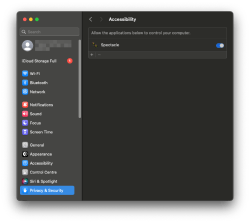

= Haisi's automated dev setup

I configure my development machine in a particular way, which suits my workflows and preferences.
Configurations include specific software installed, system configuration, dotfiles, project-templates, second-brain etc.

As a software consultant I frequently jump between software projects of various companies.
Mostly, this means I have to use the hardware and OS provided by my customer — usually an Ubuntu VM or a MacBook.

In order to re-create my preferred setup as quickly and as reliably as possible,
I documented and largely automated the setup process using https://github.com/ansible/ansible[Ansible].
Certain steps still require manual intervention for tasks such as authentication into various services.
I use this README to point them out.
Furthermore, this documentation serves as an explanation why I configure my system a certain way
in case you would like to adapt a similar setup-process as me.

== Start

1. `git clone --recurse-submodules https://github.com/haisi/dotfiles.git ~/my-dev-setup && ~/my-dev-setup/init.sh`

:toc:

== Overriding Defaults

See `./vars.yml`

== What is Ansible

Ansible is an open-source automation tool used for configuration management and task automation.
It simplifies and documents repetitive tasks by allowing users to automate the provisioning and management of systems and applications **through declarative code** called playbooks, written in YAML.

Ansible uses modules to carry out tasks. Modules are small programs that perform specific actions (e.g., installing packages, copying files, restarting services) on target machines.

Ansible is **idempotent**, meaning it only changes the system's state if necessary. It checks the current state against the desired state and applies changes only when there's a divergence.

== Tags

Most of my Ansible are tagged.
Meaning, you can selectively choose which tasks you want to (re-)run with:

[source,bash]
----
# Only run the tasks tagged with 'macos_defaults'
ansible-playbook main.yml --tags "macos_defaults"
# Multiple tags
ansible-playbook main.yml --tags "brew_formula,brew_cask"
# To decrypt ansible-vault encrypted files on copy automatically
ansible-playbook main.yml --tags "aws" --ask-vault-pass
----

.Available Ansible Tags
* macos_defaults
* links
* repos
* aws
* packages (runs all package installs)
** brew_taps
** brew_formula
** brew_cask
** apt
** pip
** npm
** chrome
* shells
* dock

== Structure

[source]
----
├─ vars                        # TBD
│   ├─ apt.yml                 # Ubuntu: Packages to be installed on through APT
│   ├─ casks.yml               # MacOS: Brew casks to install
│   ├─ formula.yml             # MacOS: Brew formulas to install
│   ├─ pip.yml                 # PIP items to install
│   └─ npm.yml                 # NPM items to install
├─ tasks
│   ├─ debian.yml
│   ├─ gnome_defaults.yml
│   ├─ link_files.yml
│   ├─ macos_defaults.yml
│   ├─ packages.yml
│   ├─ shells.yml
│   └─ .zshc                   # TODO
├─ .dotfiles                   # Contains all dotfiles which are then linked to the home-dir
│   ├─ .aliases
│   ├─ .export
│   ├─ .functions              # TODO
│   ├─ .gitconfig              # TODO
│   ├─ .gitignore_gloabl       # TODO
│   ├─ .path                   # TODO
│   └─ .zshc                   # TODO
└─ tasks                     #
    └─ macos.bash
----

== Manual Steps

. Copy/Create SSH keys
. Configure Spectacle
. Configure Itsycal
. Configure menumeters
. Configure IntelliJ

Through app store
echo "Install the following tools manually through the app store"
echo -e '\e]8;;https://apps.apple.com/us/app/gestimer/id990588172\aGestimer\e]8;;\a'
echo -e '\e]8;;https://apps.apple.com/us/app/gestimer/id1355679052\aDropover\e]8;;\a' #

=== End State

[source]
----
~
├─ private                        # helps me easily differentiate what is mine
│   ├─ projects                   # I like to keep private and open-source projects around, which I can use to look-up things
│   ├─ project-templates (repo)   # Project-templates for: bash-scripts; markdown-presentation
│   │   ├─ markdown-presentation
│   │   └─ TODO
│   └─ learnings (repos)         # Per subject/technology I create a repo with my notes on it. In a sense this is my professional, second-brain, which I try to keep up to date whenever I learn something new during my private or professional life
│   │   ├─ learning-misc         # Topics which don't fit into their own repo yet
│   │   ├─ learning-java
│   │   ├─ learning-spring
│   │   ├─ learning-ansible
│   │   └─ learning-k8s
└─ .dotfiles                     # Common approach to configure unix based system
    └─ macos.bash
----

=== Open Tasks

* [ ] Create notes for all manual steps
* [ ] Add prompt (Ansible) to configure variables such as name, email address, which tools should be used
* [ ] Document tags

== Contribution
Generally, this project — as the name implies — serves to automate and document MY setup.
However, I am more than open to improvement suggestions such as:
- Cool tools to install
- Handy bash aliases
- More steps to automate

Simply https://github.com/haisi/dotfiles/issues/new[create a new issue] or https://github.com/haisi/dotfiles/compare[open a PR] 😊

== Acknowledgement & Inspiration

The concept of putting ones dotfiles under version control or automating ones dev-setup in nothing new.
On GitHub alone there are almost 200K similar repos --- with https://github.com/mathiasbynens/dotfiles[certain popular repos] reaching over 28K stars!
Hence, I like to give credit to some repos I used for inspiration:

* https://github.com/geerlingguy/mac-dev-playbook
* https://github.com/elnappo/dotfiles
* https://github.com/mathiasbynens/dotfiles
* https://github.com/alrra/dotfiles
* https://github.com/cowboy/dotfiles

== Author

This project was created https://selman.li/[Hasan Kara].

== License

Public domain.